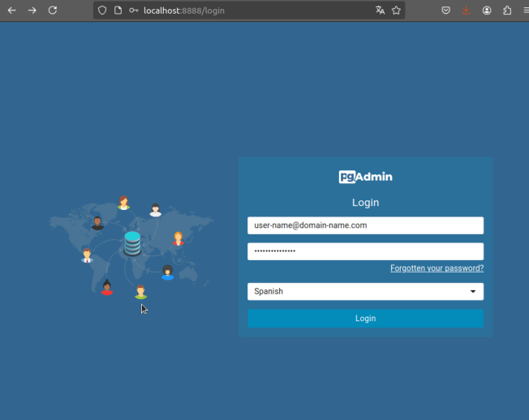
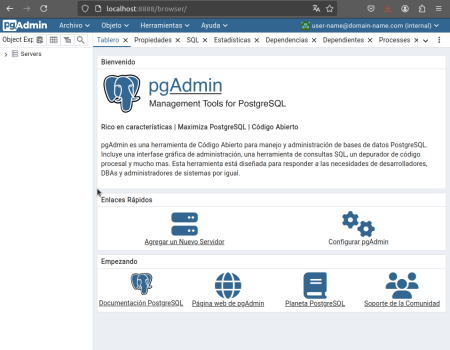
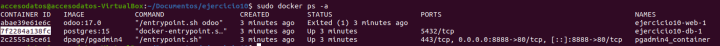
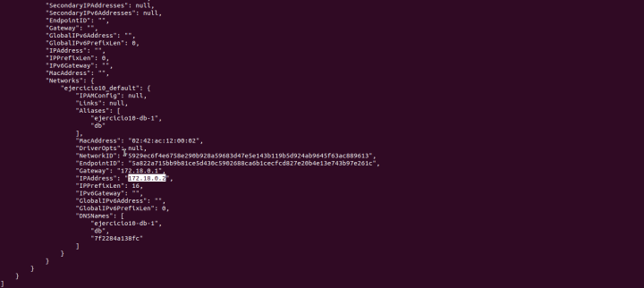
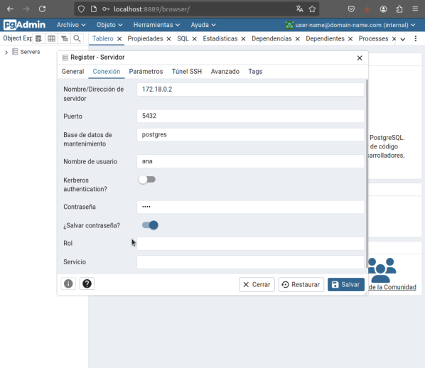
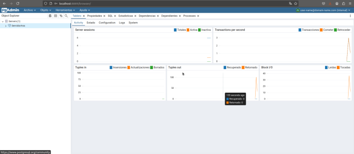
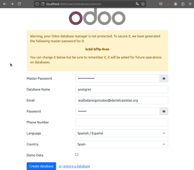
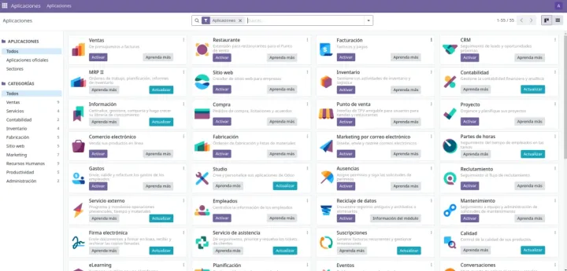

# 🚀 Ejercicio 10 - Configuración de Odoo con Docker Compose 🐳

---

👤 **Autor:** Ana Valladares González

---

## 1️⃣ Preparar el entorno

Creamos un directorio para el ejercicio y nos movemos a él:

```bash
mkdir ejercicio10
cd ejercicio10
```
> [!TIP]
> Usamos nombres descriptivos para los directorios y archivos para facilitar la organización de los proyectos.

## 2️⃣ Crear un archivo compose

Creamos un archivo `docker-compose.yml` con el siguiente contenido:

```yml
services:
  web:
    image: odoo:17.0
    depends_on:
      - db
    ports:
      - "8083:8069"
  db:
    image: postgres:15
    environment:
      - POSTGRES_DB=postgres
      - POSTGRES_PASSWORD=odoo
      - POSTGRES_USER=odoo
  pgadmin:
    image: dpage/pgadmin4
    container_name: pgadmin4_container
    restart: always
    ports:
      - "8888:80"
    environment:
      PGADMIN_DEFAULT_EMAIL: user-name@domain-name.com
      PGADMIN_DEFAULT_PASSWORD: strong-password
    volumes:
      - pgadmin-data:/var/lib/pgadmin
volumes:
  pgadmin-data:
```

🚀 Levantamos los servicios:

```bash
docker-compose up -d
```

📸 Vista previa:


## 3️⃣ Acceder a pgAdmin

> [!NOTE]
> pgAdmin estará disponible en http://localhost:8888. Usamos las credenciales definidas en `docker-compose.yml` para iniciar sesión.

### 3.1 Iniciamos sesión

Accedemos a pgAdmin en `http://localhost:8888` y nos logueamos con las credenciales..



Lo cual una vez iniciada la sesión, nos llevará a la siguiente página:



### 3.2 Agregamos un nuevo servidor

Pulsamos en el botón "Agregar un Nuevo Servidor".


Nos saldrá una pantalla en la que podremos registrar el servidor que requerimos. Para esto, debemos en la primera pantalla que nos aparece, denominada 'General' escribir el nombre del servidor que queramos.


Ahora, para cubrir la siguiente pantalla ('Conexión'), debemos localizar la dirección ip del contenedor de nuestra base de datos, esto se hace mediante los comandos `sudo docker ps -a` y posteriormente, copiamos el id del contenedor de la base de datos, y utilizamos `sudo docker inspect <idcontentedor>`

> [!IMPORTANT]
Es fundamental usar la dirección IP correcta del contenedor para evitar errores de conexión.

📸 IP obtenida:




En mi caso, quedaría de la siguiente manera:



Una vez guardemos los cambios, nos deberá aparecer la siguiente pantalla:



## 4️⃣ Acceder a Odoo

Entramos en el puerto en el que hemos situado Odoo en el docker compose, y creamos un nuevo usuario.



Una vez creemos la base de datos, nos llevará a la siguiente página:



> [!TIP]
> Si tenemos algún problema durante la isntalación, siempre podemos verificar los logs de los contenedores, utilizando `docker-compose logs`.


---

### ¿Que ocurre si en el ordenador local el puerto 5432 está ocupado? ¿Y si lo estuviese el 8069? ¿Como puedes solucionarlo?

Si los puertos están ocupados, podemos cambiarlos en el archivo `docker-compose.yml` y volver a levantar los servicios con `docker-compose up -d`.

Si está ocupado el puerto 8069, debemos cambiar solo el puerto externo de odoo, como ha sido en mi caso, que he cambiado el puerto al 8083.