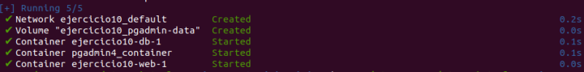
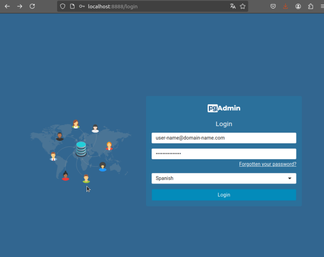
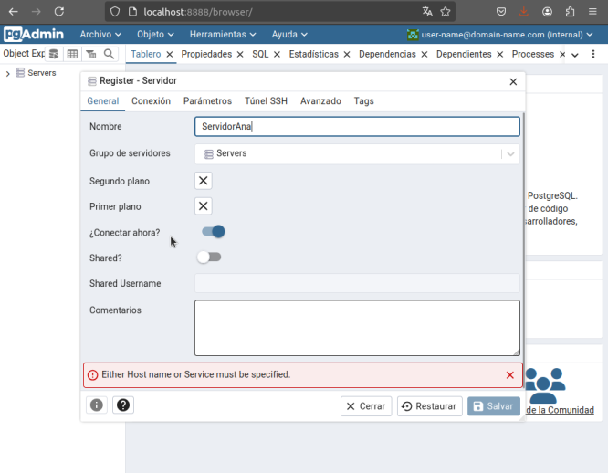
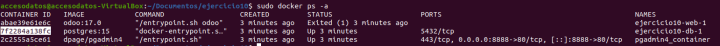
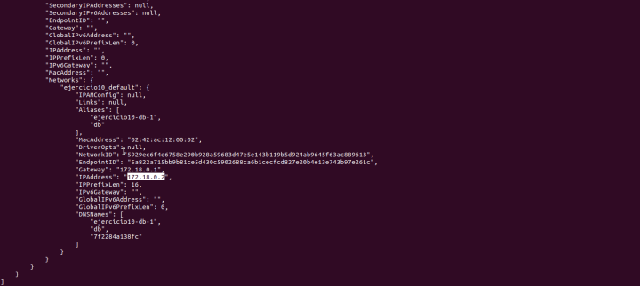
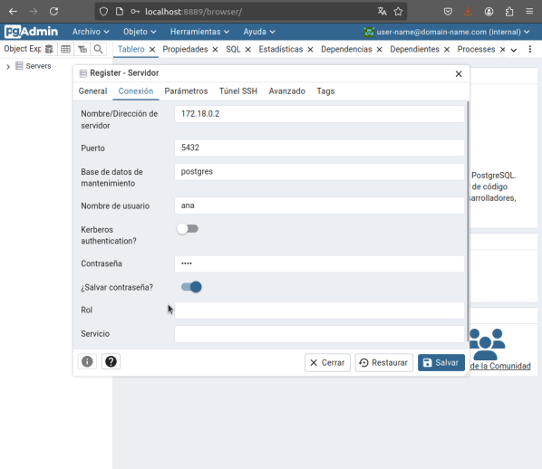
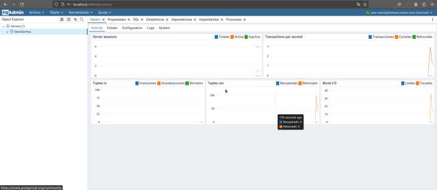
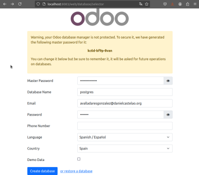
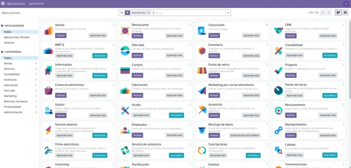

# 🚀 Ejercicio 10 - Configuración de Odoo con Docker Compose 🐳

---

👤 **Autor:** Ana Valladares González

---

## 1️⃣ Preparar el entorno

Creamos un directorio para el ejercicio y nos movemos a él:

```bash
mkdir ejercicio10
cd ejercicio10
```
> [!TIP]
> Usamos nombres descriptivos para los directorios y archivos para facilitar la organización de los proyectos.

## 2️⃣ Crear un archivo compose

Creamos un archivo `docker-compose.yml` con el siguiente contenido:

```yml
services:
  web:
    image: odoo:17.0 # Usamos la versión 17.0 de Odoo
    depends_on:
      - db # Dependemos del servicio db
    ports:
      - "8083:8069" # Mapeamos el puerto 8069 de Odoo al 8083 del host
  db:
    image: postgres:15 # Usamos la versión 15 de Postgres
    environment:
      - POSTGRES_DB=postgres # Nombre de la base de datos
      - POSTGRES_PASSWORD=odoo # Contraseña de la base de datos
      - POSTGRES_USER=odoo # Usuario de la base de datos
  pgadmin:
    image: dpage/pgadmin4 # Usamos la imagen dpage/pgadmin4
    container_name: pgadmin4_container # Nombre del contenedor
    restart: always # Reiniciar siempre
    ports:
      - "8888:80" # Mapeamos el puerto 80 de pgAdmin al 8888 del host
    environment:
      PGADMIN_DEFAULT_EMAIL: user-name@domain-name.com # Correo de pgAdmin
      PGADMIN_DEFAULT_PASSWORD: strong-password # Contraseña de pgAdmin
    volumes:
      - pgadmin-data:/var/lib/pgadmin # Volumen para persistir los datos
volumes:
  pgadmin-data:
```

🚀 Levantamos los servicios:

```bash
docker-compose up -d
```

📸 Vista previa:



## 3️⃣ Acceder a pgAdmin

> [!NOTE]
> pgAdmin estará disponible en http://localhost:8888. Usamos las credenciales definidas en `docker-compose.yml` para iniciar sesión.

### 3.1 Iniciamos sesión

Accedemos a pgAdmin en `http://localhost:8888` y nos logueamos con las credenciales..



Lo cual una vez iniciada la sesión, nos llevará a la siguiente página:


### 3.2 Agregamos un nuevo servidor

Pulsamos en el botón "Agregar un Nuevo Servidor".


Nos saldrá una pantalla en la que podremos registrar el servidor que requerimos. Para esto, debemos en la primera pantalla que nos aparece, denominada 'General' escribir el nombre del servidor que queramos.



Ahora, para cubrir la siguiente pantalla ('Conexión'), debemos localizar la dirección ip del contenedor de nuestra base de datos, esto se hace mediante los comandos `sudo docker ps -a` y posteriormente, copiamos el id del contenedor de la base de datos, y utilizamos `sudo docker inspect <idcontentedor>`

> [!IMPORTANT]
Es fundamental usar la dirección IP correcta del contenedor para evitar errores de conexión.

📸 IP obtenida:




En mi caso, quedaría de la siguiente manera:



Una vez guardemos los cambios, nos deberá aparecer la siguiente pantalla:



## 4️⃣ Acceder a Odoo

Entramos en el puerto en el que hemos situado Odoo en el docker compose, y creamos un nuevo usuario.



Una vez creemos la base de datos, nos llevará a la siguiente página:



> [!TIP]
> Si tenemos algún problema durante la isntalación, siempre podemos verificar los logs de los contenedores, utilizando `docker-compose logs`.


---

### ¿Que ocurre si en el ordenador local el puerto 5432 está ocupado? ¿Y si lo estuviese el 8069? ¿Como puedes solucionarlo?

Si el 5432 está ocupado nos dará error el contenedor de la base de datos, porque es el puerto por defecto de postgres.

Si el 8069 está ocupado nos dará error el contenedor de odoo, porque es el puerto por defecto de odoo.

Para solucionarlo, debemos cambiar los puertos en el archivo `docker-compose.yml` y volver a levantar los servicios con `docker-compose up -d`.